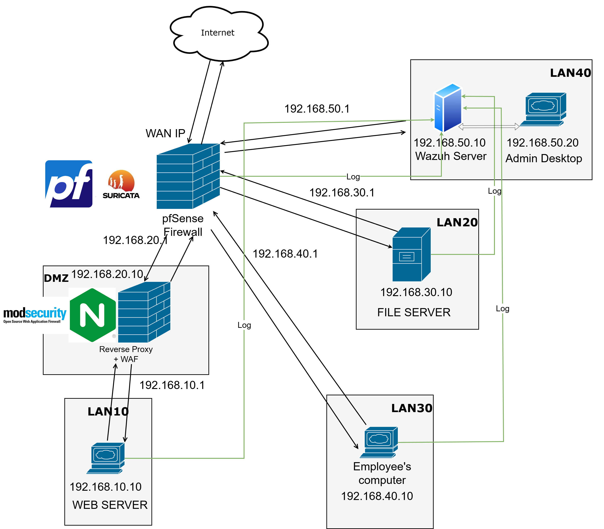

# Defense-in-Depth Security Architecture

An academic cyber range project that simulates a Red Team vs Blue Team engagement in a segmented enterprise network. The project focuses on designing, deploying, monitoring, and improving a defense-in-depth architecture against external web attacks, internal reconnaissance, lateral movement, privilege escalation, and data exposure scenarios.

This repository contains the final network topology and project reports. The lab was built in a controlled VMware environment for learning and defensive validation only.

## My Role

I worked on the Blue Team side, responsible for designing and operating the defensive architecture:

- Designed a segmented network model using pfSense as the central gateway and firewall.
- Implemented DMZ isolation with Nginx Reverse Proxy and ModSecurity WAF.
- Configured IDS/IPS monitoring with Suricata and centralized security monitoring with Wazuh SIEM.
- Hardened Linux servers, Docker usage, Samba file sharing, and internal access controls.
- Built firewall rules based on default-deny, least privilege, and Zero Trust principles.
- Investigated Red Team activity and documented incident response actions, mitigations, and lessons learned.

## Architecture Overview

The network follows a defense-in-depth model with strict network segmentation. Each zone has a specific trust level and role.

| Zone | Subnet | Main Components | Purpose |
| --- | --- | --- | --- |
| WAN | DHCP | Internet-facing access | Untrusted zone, only required public traffic is allowed |
| DMZ | 192.168.20.0/24 | Nginx Reverse Proxy, ModSecurity WAF | Filters external HTTP traffic before forwarding to the backend |
| LAN10 | 192.168.10.0/24 | Web Server, Docker application | Hosts backend web services, only reachable through the DMZ proxy |
| LAN20 | 192.168.30.0/24 | Samba File Server | Stores internal files with authentication and SMB encryption |
| LAN30 | 192.168.40.0/24 | Employee workstation | Low-trust user network with restricted access to server zones |
| LAN40 | 192.168.50.0/24 | Wazuh SIEM, Admin Desktop | Security monitoring and privileged administration zone |

All inter-zone traffic is routed through pfSense and controlled by explicit firewall rules. The design prevents direct access from WAN to internal servers and limits lateral movement if one endpoint is compromised.

## Defensive Controls

### Network Security

- pfSense firewall as the central routing and policy enforcement point.
- Default-deny firewall policy with only required traffic allowed.
- ICMP blocking on WAN to reduce basic reconnaissance.
- Anti-lateral-movement rules between DMZ, LAN10, LAN20, LAN30, and LAN40.
- Separate administration zone for Wazuh and privileged access.
- Local NTP routing through internal gateways to keep logs synchronized.

### Web Protection

- Nginx Reverse Proxy deployed in the DMZ.
- ModSecurity WAF enabled with OWASP Core Rule Set.
- Public traffic is forwarded to the backend Web Server only after WAF inspection.
- Sensitive Spring Boot paths such as `/actuator`, `/env`, `/heapdump`, and `/loggers` are blocked at the proxy layer.
- Server banner hardening with `server_tokens off`.

### Monitoring and Detection

- Suricata IDS/IPS deployed through pfSense to detect scans, exploits, and suspicious traffic.
- Wazuh SIEM used for centralized log collection and alert correlation.
- Wazuh Agents deployed on server and endpoint zones.
- File Integrity Monitoring configured for sensitive directories such as `/etc`, `/var/www`, Nginx configuration, Docker application paths, and file-share paths.
- Rootcheck enabled to detect rootkits, backdoors, trojans, and suspicious system changes.

### Host and Data Hardening

- SSH hardening with root login disabled and OS banner reduction.
- Separation between normal users and administrative accounts.
- Removal of unnecessary `sudo` and Docker group privileges from standard users.
- Docker `userns-remap` used to reduce container breakout impact.
- Samba file sharing hardened with authentication, restrictive file permissions, SMBv3, and required SMB encryption.
- ClamAV scheduled scans for uploaded/shared files.
- Daily backup scripts with retention policy and Wazuh-visible logging.

## Red Team Scenarios and Blue Team Response

The Red Team tested both external and internal attack paths. The Blue Team used these findings to validate and improve the architecture.

| Scenario | Detection / Finding | Blue Team Mitigation |
| --- | --- | --- |
| Network reconnaissance | WAN ICMP blocked; only HTTP exposed | pfSense default-deny and limited public exposure |
| SQL Injection, XSS, Path Traversal, Command Injection | WAF returned HTTP 403 for common malicious payloads | ModSecurity with OWASP CRS in blocking mode |
| Shellshock RCE attempt | Suricata detected exploit pattern; WAF blocked payload | IDS/IPS alerting and ModSecurity filtering |
| DDoS / botnet-like traffic | Wazuh correlated repeated firewall drops into a high-level alert | pfSense and Suricata dropped suspicious traffic before reaching servers |
| Internal port scanning | Employee network attempted scanning server zones | LAN30 isolation and Zero Trust firewall rules blocked movement |
| Docker privilege escalation | Normal user had dangerous Docker access | Removed Docker group access and enabled Docker user namespace remapping |
| Spring Boot Actuator exposure | `/actuator/env` exposed sensitive configuration risk | Nginx reverse proxy blocked sensitive paths and returned 404 |
| Anonymous Samba access and old Samba version | File server allowed weak access and outdated service exposure | Disabled guest access, enforced SMB authentication/encryption, upgraded Samba |
| Log time drift | Server logs were not synchronized due to network isolation | Internal NTP access through gateway rules restored reliable timelines |

## Key Reports

- `Blueteam_Reports/SoDoCauTrucMangChiTiet.pdf`: Detailed network segmentation and data flow design.
- `Blueteam_Reports/ChinhSachBaoMat.pdf`: Security policy, firewall strategy, hardening requirements, and compliance-oriented controls.
- `Blueteam_Reports/HuongDanCauHinh.pdf`: Configuration guide for pfSense, Suricata, DMZ reverse proxy, WAF, LAN10 Web Server, LAN20 File Server, LAN30 employee workstation, and LAN40 Wazuh/Admin zone.
- `Blueteam_Reports/NhatKyTanCong.pdf`: Blue Team attack detection and mitigation log.
- `Blueteam_Reports/UngPhoSuCoVaBaiHocKinhNghiem.pdf`: Incident response case studies and lessons learned.
- `Redteam_Reports/`: Red Team reconnaissance, exploitation attempts, findings, and recommendations.

